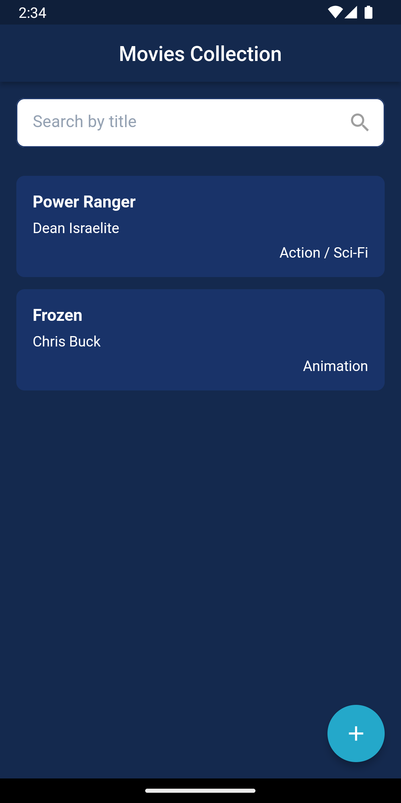
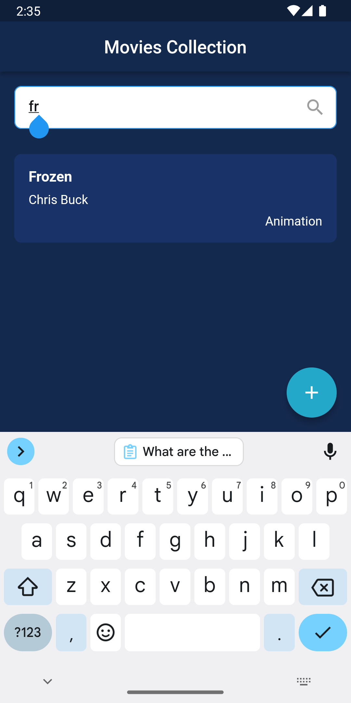
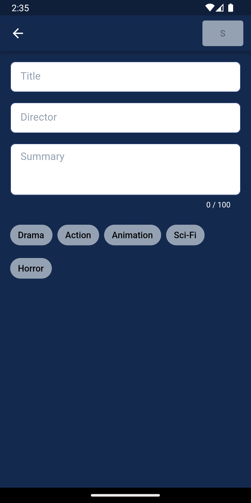
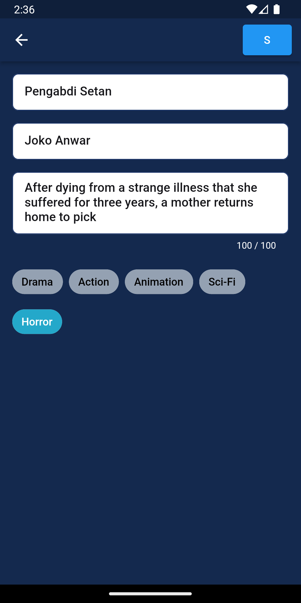
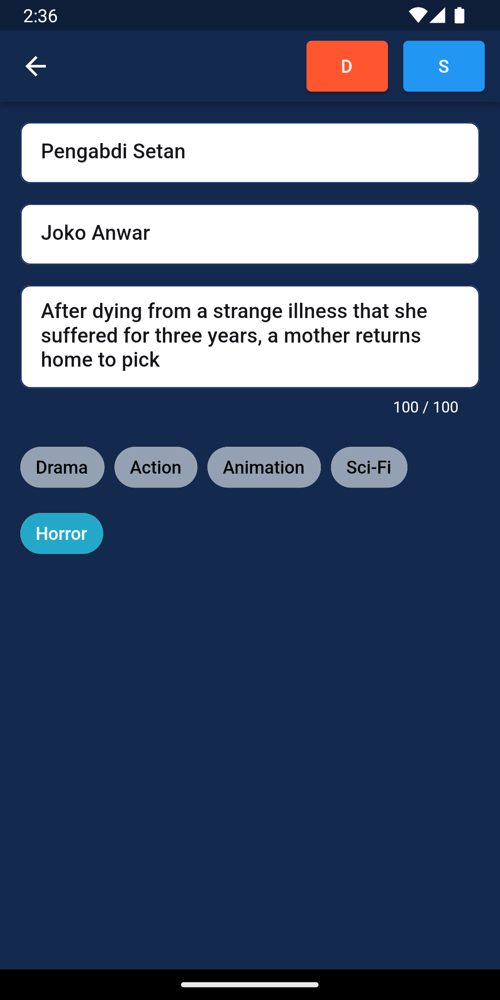
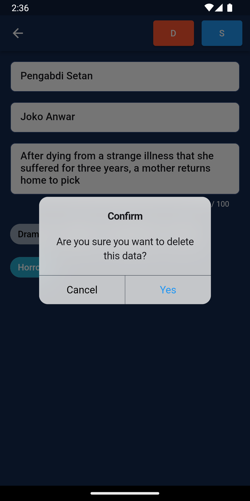
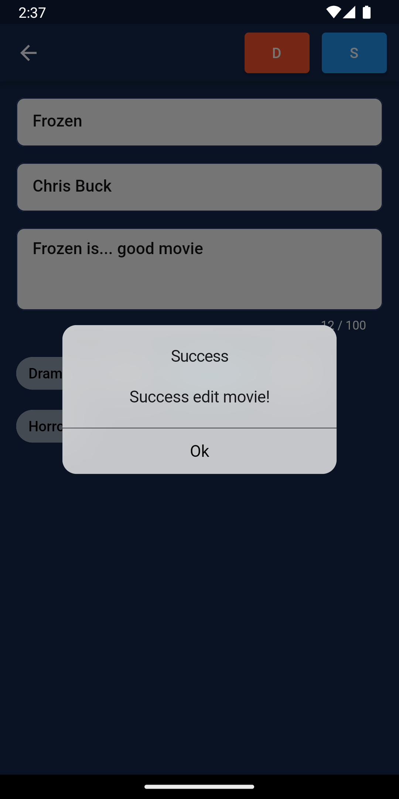

# movie_app

## Getting Started

The Movie app is an application built with the Flutter framework. This app implements the clean architecture concept and follows the Domain-Driven Design (DDD) folder structure. It also utilizes the MobX state management approach.

### Requirement:
* Flutter Version: 3.13.9

### Installation:
* Clone this project..
* Run the following commands in the terminal to launch the application:
 1. "flutter pub get"
 2. "flutter run"

### Features:
* Splash Screen

* Movie List

* Search Movie

* Add Movie

* Edit Movie

* Delete Movie

### Packages & Libraries:
* auto_route: Used to create declarative routing in Flutter.

* flutter_mobx: Implementation of state management with MobX in Flutter.

* dartz: Used for functional programming.

* freezed: Used for generated code and immutable values.

* get_it: Used for dependency injection.

* injectable: Used for dependency injection.

* intl: Used for internationalization and localization.

* pull_to_refresh: Used for pull-to-refresh functionality.

* shimmer: Used for shimmer loading effect.

* uuid: Used to generate UUIDs in Flutter.

                
